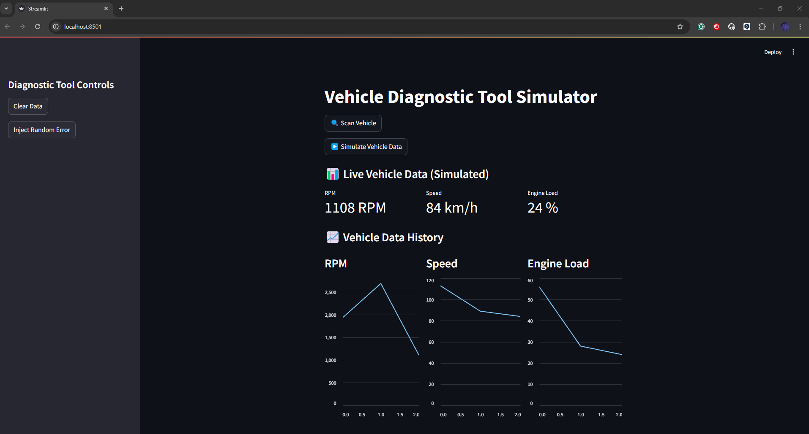

# Vehicle-Diagnostic-Tool

🚗 VDT-Sim — Vehicle Diagnostic Tool Simulation

VDT-Sim is a lightweight, interactive Vehicle Diagnostic Tool Simulator built using Python & Streamlit.
This project simulates real-time vehicle telemetry data such as RPM, Speed, and Engine Load, along with simulated OBD-II Diagnostic Trouble Codes (DTCs).

It was developed as a practical demonstration of real-time vehicle system data visualization and diagnostic simulation.

🎯 Features
✅ Real-time simulation of RPM, Speed, and Engine Load
✅ Live updating graphs with historical data
✅ "🔍 Scan Vehicle" button with animated feedback
✅ "🗑️ Clear Data" button to reset the simulation
✅ "💥 Inject Random Error" option to simulate fault codes
✅ Simple & responsive web interface (Streamlit)
✅ Designed as a learning and diagnostic demonstration tool

🚀 Live Demo
🌐 Try it live on Streamlit Cloud:
https://vdt-sim-jv2fn3jgcg4ihr6vy49xvu.streamlit.app/

🖥️ Installation
1.Clone the repository
git clone https://github.com/JoriRas/VDT-Sim.git
cd VDT-Sim

2.Install dependencies
pip install -r requirements.txt

3.Add ONB Dataset
Place your obd_dataset.csv inside the /data folder.

Run the App
streamlit run app.py
Open your browser at http://localhost:8501

📝 Future Improvements
Export diagnostic report as PDF

Add simulation speed control

Mobile-friendly layout

💡 Project Purpose
This project was created as part of a professional portfolio to demonstrate knowledge of vehicle systems, diagnostic protocols (OBD-II), data visualization, and Python software development.
It aligns with roles involving vehicle electrical and software systems, such as the Vehicle Systems Specialist position at Patria.
